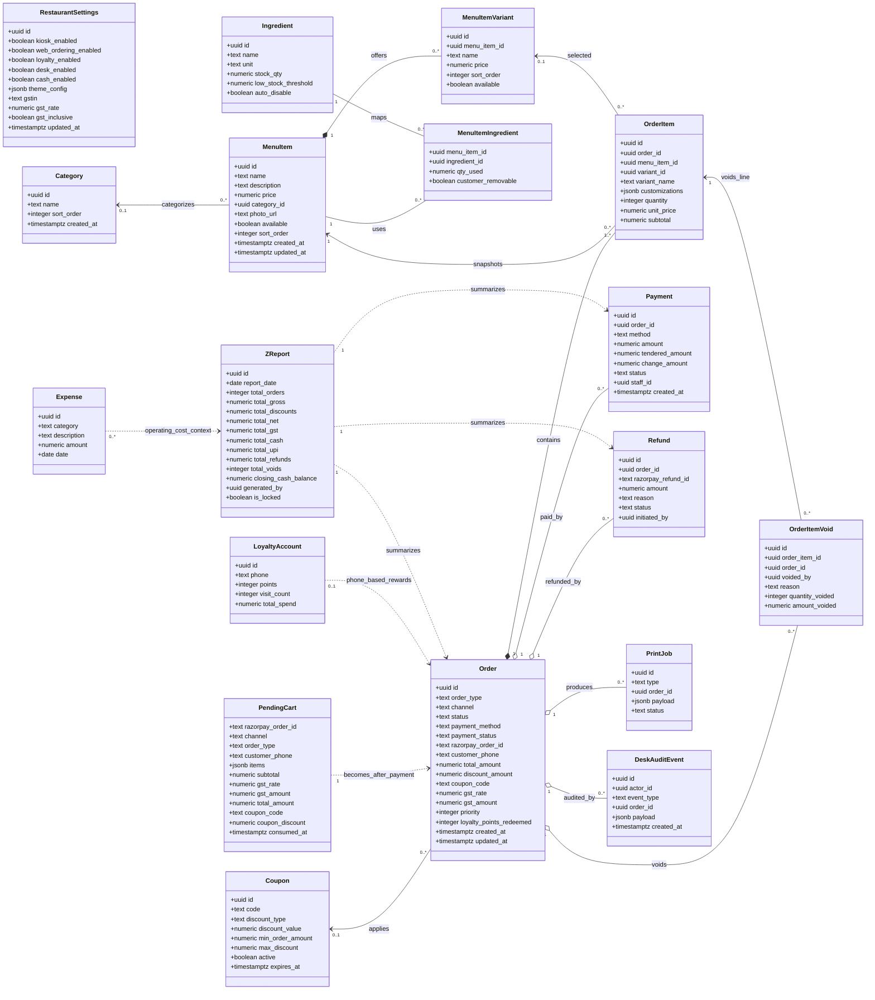
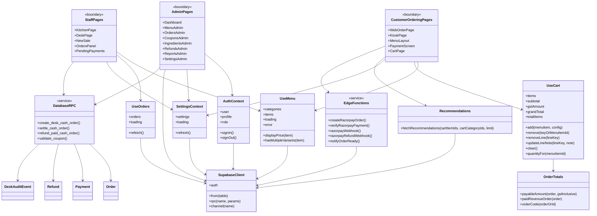

# Class Diagram

This codebase is a React/Vite application with Supabase as the durable domain model. It does not define many JavaScript classes, so this diagram models:

- database tables as domain classes/entities,
- React hooks and helper modules as services,
- route-level pages as boundary/controllers,
- Supabase Edge Functions/RPCs as application services.

## Domain Model

## Application Modules

## Notes

- `tables`, `table_sessions`, and `staff_requests` exist in earlier migrations but are dropped by `020_drop_tables_waiter_qr.sql`; they are not part of the current schema diagram.
- `OrderItem.variant_name` and `OrderItem.customizations` intentionally snapshot the customer-visible line configuration so kitchen tickets and invoices remain stable even if the menu changes later.
- `PendingCart` is an Edge Function staging table for Razorpay checkout. It is consumed into a real `Order` after payment capture.
- `LoyaltyAccount` is linked by `customer_phone`, not a foreign key, so the diagram shows it as a dependency rather than a strict association.
