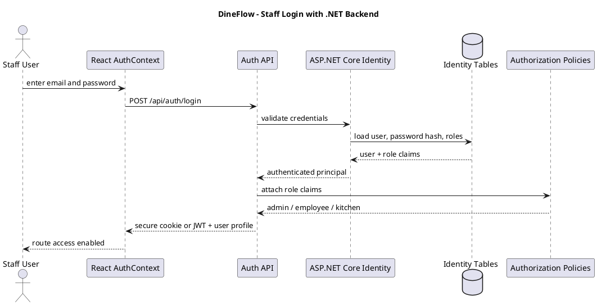
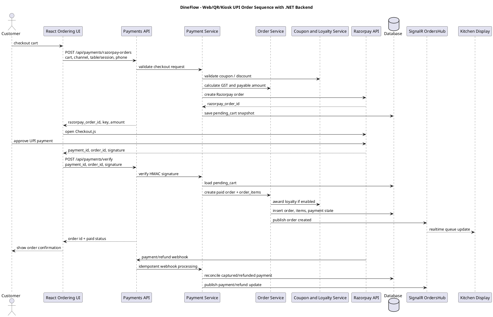
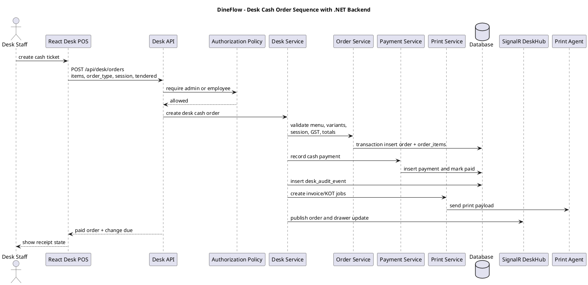

# DineFlow UML Compound Diagram - .NET Backend

This document models the current DineFlow React/Supabase codebase as the target architecture after replacing Supabase with an ASP.NET Core backend. It preserves the implemented frontend surfaces and maps Supabase features to .NET equivalents:

- Supabase Auth -> ASP.NET Core Identity + JWT/cookie sessions
- Supabase table queries -> REST controllers + EF Core
- Supabase RPC functions -> application service commands
- Supabase Realtime -> SignalR hubs
- Supabase Edge Functions -> API endpoints/background workers
- Postgres RLS -> ASP.NET Core authorization policies + service-layer guards

## Compound Component Diagram

```plantuml
@startuml
title DineFlow - UML Compound Component Diagram with .NET Backend

skinparam componentStyle rectangle
skinparam packageStyle rectangle
skinparam shadowing false
skinparam defaultFontName Arial
skinparam ArrowColor #555555
skinparam ComponentBorderColor #555555
skinparam PackageBorderColor #777777
skinparam DatabaseBorderColor #555555

actor "Customer" as Customer
actor "Kiosk User" as KioskUser
actor "Kitchen Staff" as KitchenStaff
actor "Desk Staff" as DeskStaff
actor "Admin" as Admin

node "Browser / PWA Runtime" as Browser {
  package "React Frontend\nVite + React Router + React Query" as Frontend {
    component "Web Ordering\n/order" as WebOrder
    component "QR Table Ordering\n/menu/:tableId" as QROrder
    component "Self-Service Kiosk\n/kiosk" as Kiosk
    component "Kitchen Display\n/kitchen" as Kitchen
    component "Desk POS\n/desk" as Desk
    component "Admin Console\n/admin/*" as AdminUi
    component "Offline Fallback\n/offline" as Offline

    component "Shared UI Kit\nbuttons, modals, tables,\nforms, status badges" as SharedUi
    component "Cart and Totals Logic\nuseCart, orderTotals,\nGST, discounts" as CartLogic
    component "Data Hooks\nuseMenu, useOrders,\nadmin/desk loaders" as DataHooks
    component "Auth Context\nroles: admin, employee,\nkitchen" as AuthContext
    component "Settings Context\nrestaurant flags,\nGST, theme config" as SettingsContext
    component "UPI Payment Flow\nRazorpay Checkout JS" as UpiFlow
    component "Recommendation Helper\nitem_pairs fallback" as Recs
  }
}

node "ASP.NET Core Backend" as Backend {
  package "API Layer" as ApiLayer {
    component "Menu API\ncategories, items,\nvariants, ingredients" as MenuApi
    component "Orders API\ncreate, status,\npriority, cancel" as OrdersApi
    component "Payments API\nUPI, cash,\nrefunds, webhooks" as PaymentsApi
    component "Desk API\ncash drawer,\nsettlement, reprint" as DeskApi
    component "Kitchen API\naccept, prepare,\nready, complete" as KitchenApi
    component "Admin API\nsettings, reports,\ncoupons, inventory" as AdminApi
    component "Auth API\nlogin, logout,\ncurrent user" as AuthApi
    component "SignalR Hubs\norders, menu,\nsettings, refunds,\ndesk audit" as SignalR
  }

  package "Business Logic Layer" as BusinessLayer {
    component "Menu Service\navailability,\nvariants, removables" as MenuService
    component "Order Service\nweb, QR, kiosk,\ndesk orders" as OrderService
    component "Payment Service\nRazorpay orders,\nsignature verification,\nrefund processing" as PaymentService
    component "Desk Service\ncash orders,\npending payments,\naudit events" as DeskService
    component "Kitchen Service\nworkflow transitions,\npriority, KOT trigger" as KitchenService
    component "Settings Service\nfeature flags,\nGST calculation" as SettingsService
    component "Coupon and Loyalty Service\nvalidate coupon,\naward points" as LoyaltyService
    component "Inventory Service\nstock deduction,\nauto-disable items" as InventoryService
    component "Reporting Service\nsales, refunds,\nexpenses, Z reports" as ReportingService
    component "Print Service\nKOT and invoice jobs" as PrintService
    component "Notification Service\norder ready alerts" as NotificationService
  }

  package "Security Layer" as SecurityLayer {
    component "ASP.NET Core Identity\nusers, roles, claims" as Identity
    component "JWT / Secure Cookies\nsession persistence" as Tokens
    component "Authorization Policies\nadmin, employee,\nkitchen, public" as Policies
  }

  package "Data Access Layer" as DataAccessLayer {
    component "EF Core DbContext" as DbContext
    component "Repositories / Queries\nmenu, orders, reports,\nsettings, payments" as Repositories
    component "Transactions\norder creation,\npayment capture,\nrefunds" as Transactions
    component "Background Workers\nwebhooks, print queue,\nnotifications, cleanup" as Workers
  }
}

database "Relational Database\nPostgreSQL or SQL Server" as Database {
  component "Identity Tables\nusers, roles,\nclaims" as IdentityTables
  component "Menu Tables\ncategories, menu_items,\nmenu_item_variants,\ningredients" as MenuTables
  component "Order Tables\norders, order_items,\ntables, table_sessions,\npending_carts" as OrderTables
  component "Payment Tables\npayments, refunds,\nRazorpay event log" as PaymentTables
  component "Operations Tables\nrestaurant_settings,\ncoupons, expenses,\nz_reports, audit_events" as OperationsTables
  component "Print Tables\nprint_jobs" as PrintTables
}

cloud "External Services" as External {
  component "Razorpay API\norders, checkout,\npayments, refunds,\nwebhooks" as Razorpay
  component "Notification Provider\nSMS / email / push" as NotifyProvider
}

node "Restaurant Local Network" as LocalNetwork {
  component "Thermal Print Agent\nlocal companion process" as PrintAgent
  component "Receipt / Kitchen Printer" as Printer
}

Customer --> WebOrder
Customer --> QROrder
KioskUser --> Kiosk
KitchenStaff --> Kitchen
DeskStaff --> Desk
Admin --> AdminUi

WebOrder --> SharedUi
QROrder --> SharedUi
Kiosk --> SharedUi
Kitchen --> SharedUi
Desk --> SharedUi
AdminUi --> SharedUi

WebOrder --> CartLogic
QROrder --> CartLogic
Kiosk --> CartLogic
Desk --> CartLogic
WebOrder --> UpiFlow
QROrder --> UpiFlow
Kiosk --> UpiFlow
WebOrder --> Recs
QROrder --> Recs

DataHooks --> MenuApi : HTTPS JSON
DataHooks --> OrdersApi : HTTPS JSON
DataHooks --> AdminApi : HTTPS JSON
AuthContext --> AuthApi : sign in / sign out
SettingsContext --> AdminApi : settings read
UpiFlow --> PaymentsApi : create / verify payment

Kitchen --> KitchenApi : status transitions
Desk --> DeskApi : cash POS actions
AdminUi --> AdminApi : admin commands
WebOrder --> SignalR : order status updates
Kiosk --> SignalR : order status updates
Kitchen --> SignalR : kitchen queue updates
Desk --> SignalR : order, payment,\ndrawer updates
AdminUi --> SignalR : menu, refunds,\nsettings updates

AuthApi --> Identity
Identity --> Tokens
MenuApi --> Policies
OrdersApi --> Policies
PaymentsApi --> Policies
DeskApi --> Policies
KitchenApi --> Policies
AdminApi --> Policies

MenuApi --> MenuService
OrdersApi --> OrderService
PaymentsApi --> PaymentService
DeskApi --> DeskService
KitchenApi --> KitchenService
AdminApi --> SettingsService
AdminApi --> ReportingService
AdminApi --> InventoryService

OrderService --> SettingsService
OrderService --> LoyaltyService
OrderService --> InventoryService
OrderService --> PrintService
PaymentService --> OrderService
PaymentService --> LoyaltyService
PaymentService --> PrintService
DeskService --> OrderService
DeskService --> PaymentService
DeskService --> PrintService
KitchenService --> PrintService
KitchenService --> NotificationService

SignalR --> OrderService : publish order events
SignalR --> MenuService : publish availability events
SignalR --> SettingsService : publish setting events
SignalR --> PaymentService : publish refund/payment events
SignalR --> DeskService : publish audit/drawer events

MenuService --> Repositories
OrderService --> Transactions
PaymentService --> Transactions
DeskService --> Transactions
KitchenService --> Repositories
SettingsService --> Repositories
LoyaltyService --> Repositories
InventoryService --> Transactions
ReportingService --> Repositories
PrintService --> Repositories
Workers --> Repositories
Repositories --> DbContext
Transactions --> DbContext

Identity --> IdentityTables
DbContext --> MenuTables
DbContext --> OrderTables
DbContext --> PaymentTables
DbContext --> OperationsTables
DbContext --> PrintTables

PaymentService --> Razorpay : create order,\nverify signature,\nrefund
Razorpay --> PaymentsApi : payment/refund webhooks
NotificationService --> NotifyProvider
PrintService --> PrintAgent : print job request
PrintAgent --> Printer

note right of Backend
  The backend replaces Supabase direct access.
  The frontend should call typed API clients
  instead of src/lib/supabase.js.
end note

note bottom of Database
  Existing Supabase migrations provide the
  target domain model: menu, orders, tables,
  settings, payments, refunds, print jobs,
  coupons, reports, and audit events.
end note
@enduml
```

## Login and Authorization Sequence

## UPI Order and Payment Sequence

## Desk Cash POS Sequence

## Layer Mapping From Current Supabase Code

| Current Supabase usage | .NET replacement |
| --- | --- |
| `src/lib/supabase.js` client | typed `apiClient` + SignalR client |
| `supabase.auth.signInWithPassword` | `POST /api/auth/login` using ASP.NET Core Identity |
| `supabase.from('categories')`, `menu_items`, `ingredients` | `MenuController` + `MenuService` + EF Core |
| `supabase.from('orders')`, `order_items`, `refunds` | `OrdersController` + `OrderService` + EF Core |
| `supabase.rpc('create_desk_cash_order')` | `POST /api/desk/orders` transactional service method |
| `supabase.rpc('settle_cash_order')` | `POST /api/desk/orders/{id}/settle-cash` |
| `supabase.rpc('refund_paid_cash_order')` | `POST /api/payments/cash-refunds` |
| `supabase.rpc('validate_coupon')` | `POST /api/coupons/validate` or internal `CouponService` |
| `supabase.functions.invoke('create-razorpay-order')` | `POST /api/payments/razorpay-orders` |
| `supabase.functions.invoke('verify-razorpay-payment')` | `POST /api/payments/verify-razorpay` |
| Supabase Realtime channels | SignalR hubs for orders, menu, settings, refunds, and desk audit |
| Supabase RLS policies | authorization attributes, policies, and service-layer validation |
